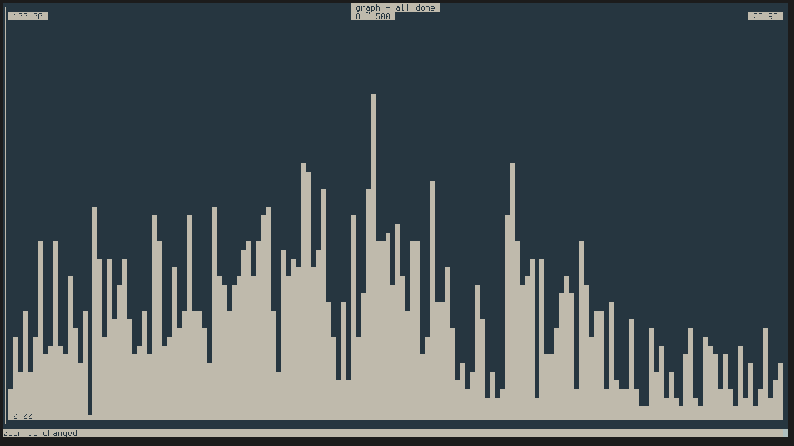

# Preface
vi-like graph mapper

# Control 
`l` - shift right

`h` - shift left

`:` - open command mode

# Commands 
> get `variable name`

> set `variable name` `value`

# Script variables
`shift` - beginning of a sample in the general dataset 

`zoom` - sample size

`ceil` - upper bound

`floor` - lower bound

`autosize` - auto scaling

`datasize` - size of the given dataset

# Usage
```./launch <path to the dataset>```
# Screenshots

